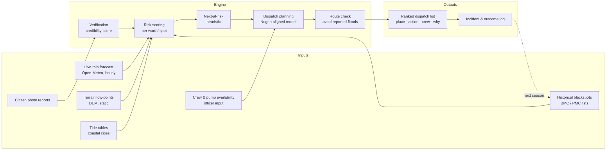

# FloodOps

> Working name. Rename is a single find-and-replace.

AI decision system for municipal flood response. Converts live rainfall, terrain, historical blackspots and photo-verified citizen reports into an explainable, prioritised dispatch plan for the city engineer: **where to go, what to do, in what order.**

Built for **Indradhanu – PCCOE International Grand Challenge 2026** (AI for Climate Change).
Domain: *Disaster Resilience → Disaster Forecasting & Response*.

---

## The problem in one line

Cities do not lack weather data. They lack a system that turns fragmented weather, terrain, historical and citizen data into an actionable response plan.

Full statement: [`docs/01-problem-statement.md`](docs/01-problem-statement.md)

---

## System at a glance

Detailed diagrams: [`docs/02-architecture.md`](docs/02-architecture.md)  
Storage (git / Postgres / object): [`docs/06-storage-architecture.md`](docs/06-storage-architecture.md)  
Domain + API surface: [`docs/07-domain-model.md`](docs/07-domain-model.md)  
Full target tree: [`docs/05-repo-structure.md`](docs/05-repo-structure.md)

---

## Honesty table

What is real, what is static, what is simulated. This table goes on the deck unchanged.

| Input | Status | Source |
|---|---|---|
| Rain forecast (hourly, per ward) | **Live** | Open-Meteo |
| Tide levels (Mumbai) | **Live** | Public tide tables |
| Citizen photo reports | **Live** (when submitted) | Our intake |
| Terrain low-point score | Static, computed once | Copernicus / SRTM DEM |
| Historical blackspots | Static, curated per city | BMC list (Mumbai), PMC PDFs + news (Pune) |
| Ward boundaries, roads | Static | Open data portals, OpenStreetMap |
| Crew / pump availability | Manual input | Officer enters |
| Live complaint feed from ULB | **Not available** | Replaced by citizen intake |
| Live water-level sensors | **Not available** | Not used |

Replay mode injects a past rain event so a monsoon can be demonstrated in any month. It is always labelled as replay.

Details: [`docs/04-data-sources.md`](docs/04-data-sources.md)

---

## Cities

| City | Role | Why |
|---|---|---|
| Mumbai | **Validation** | BMC publishes ~300–400 chronic flooding spots yearly → our top-N is scored against it. Tide adds a real second signal. |
| Pune | **Demonstration** | No dispatch system exists. Same engine, thinner data, citizen reports fill the gap. |

The engine is city-agnostic. Only the `data/cities/<city>/` folder changes.

---

## Phases

Aligned to the competition's three stages. See [`docs/03-phases.md`](docs/03-phases.md).

| Phase | Competition stage | Deliverable |
|---|---|---|
| 0 | — | This repo, problem statement, architecture |
| 1 | Idea submission (by 10 Sep 2026) | Deck PDF, Nugen slide, registration |
| 2 | Prototype + video (to 15 Nov 2026) | Working engine, Pune end-to-end, Mumbai validation number |
| 3 | Grand Finale, 24h (Jan–Feb 2027) | Hardened live demo; no new features |

---

## Repository layout

**Three stores:** Git seeds · Postgres+PostGIS · MinIO/S3 photos.  
**Packages:** `domain` · `scoring` · `database` · `infrastructure` · `shared`.  
**Apps:** `api` (use-cases) · `web` (dashboard + report).

Full tree and “what we skip from PortSense-scale platforms”: [`docs/05-repo-structure.md`](docs/05-repo-structure.md).  
`apps/` and `packages/` are created in Phase 2 — not empty scaffolding now.

---

## Words we do not use

| Don't say | Say |
|---|---|
| prediction | anticipation / next-at-risk |
| fake detection | credibility score |
| works for all India | deploys to any city; validated on Mumbai, demonstrated on Pune |
| government uses this | pilot-ready for ULBs |
| flood forecast | response prioritisation |
