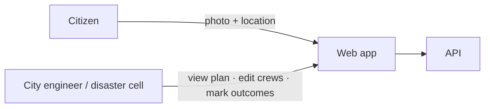
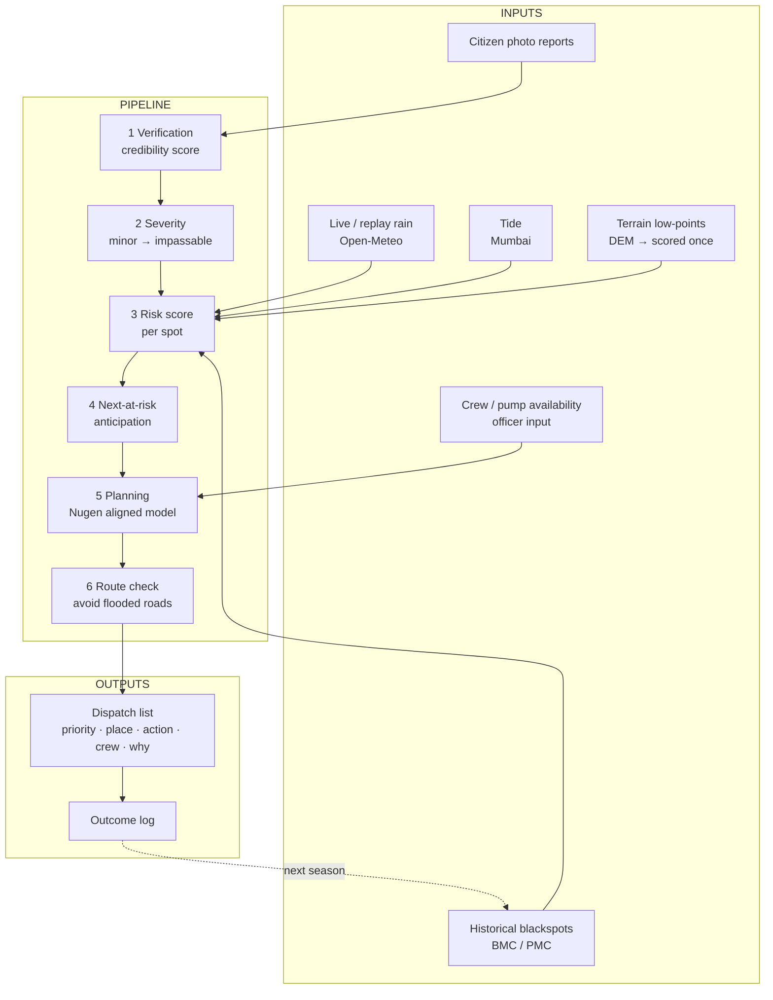
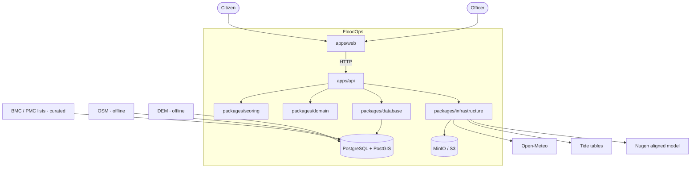
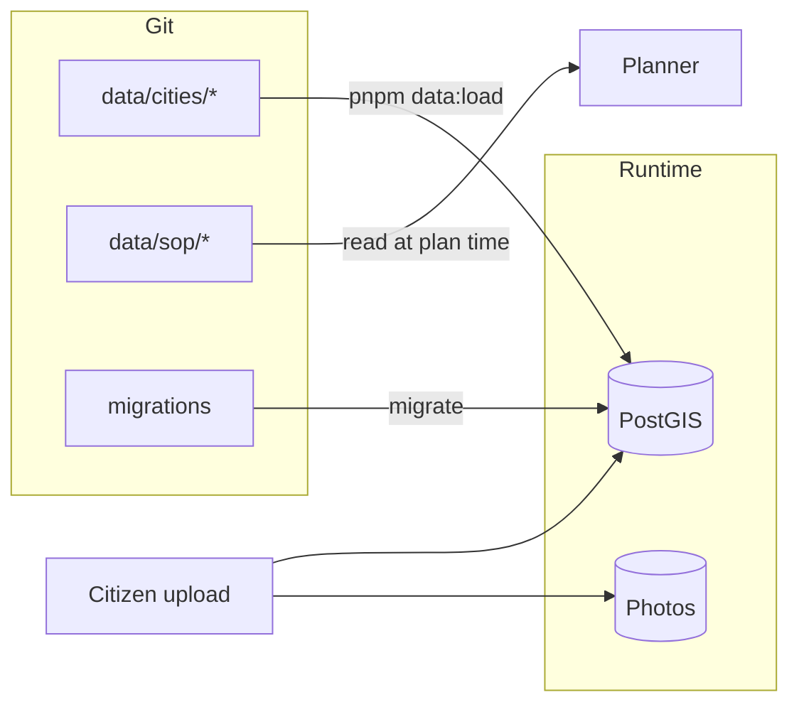
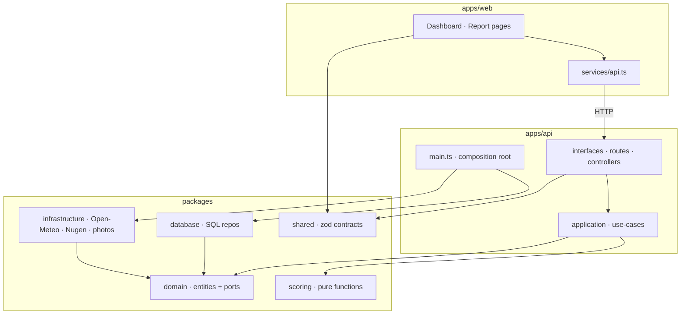
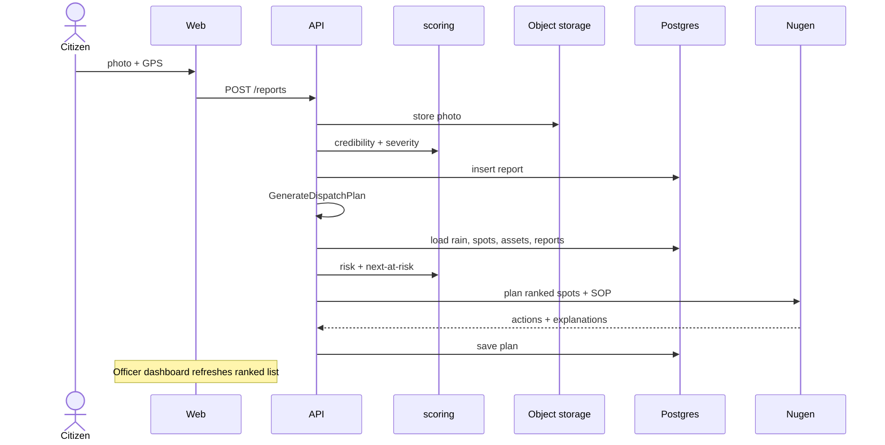
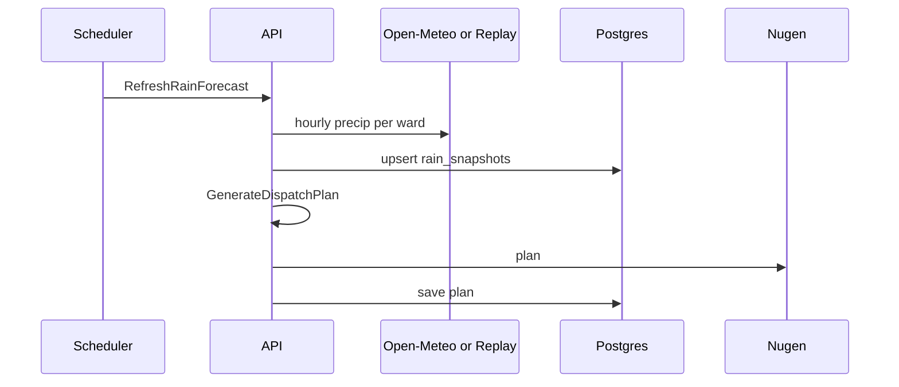
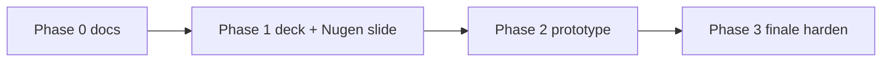

# FloodOps — Full Architecture (Start → End)

**This is the single document.** Open this first. Other docs go deeper on one slice; they do not contradict this.

| Doc | Role |
|---|---|
| **This file** | End-to-end system |
| `01-problem-statement.md` | Why we exist |
| `03-phases.md` | When we build what |
| `04-data-sources.md` | Honesty table for inputs |
| `05-repo-structure.md` | Folder tree + import rules |
| `06-storage-architecture.md` | Tables, keys, migrations in detail |
| `07-domain-model.md` | Entities, ports, API list |

Working name: **FloodOps** (rename later with one find-and-replace).

---

## 0. One sentence

```
Rain + terrain + history + citizen photos
        → verify → score → anticipate → plan (Nugen) → route-check
        → ranked dispatch list for the city engineer
        → outcomes logged for the next monsoon
```

The product is **not** a weather app. It is a **municipal response planner**.

---

## 1. Who uses it



| Actor | Job |
|---|---|
| **Citizen** | Sensor. Uploads evidence of waterlogging. Does not run the response. |
| **Officer** | Decision maker. Sees ranked list, assigns reality (crews), records outcomes. |
| **System** | Turns fragmented data into an explainable plan. |

Cities: **Mumbai** (validate against BMC list) · **Pune** (demonstrate the gap). Engine is city-agnostic.

---

## 2. End-to-end flow (the spine)



| Step | Name | What happens | Live / static |
|---|---|---|---|
| 1 | Verification | Photo: water present? geofence? EXIF age? duplicate? → credibility | Live on submit |
| 2 | Severity | Depth cues + report density + rain → minor / moderate / impassable | Live |
| 3 | Risk | Weighted: low-point × blackspot × rain × tide × verified reports | Mix |
| 4 | Anticipation | Nearby lower spots in same catchment still dry → “next at risk” | Heuristic |
| 5 | Planning | Nugen + SOP corpus → action, crew, priority, explanation | Live API |
| 6 | Route | Path depot → spot avoiding verified impassable segments | Heuristic |
| 7 | Dispatch | Officer UI | — |
| 8 | Learning | Outcome stored; not ML in v1 | Log only |

**Nugen does step 5 only.** Steps 1–4 are deterministic code so every number is explainable. If Nugen is down → ranked list without actions (`NoopPlanner`).

---

## 3. System context (everything that touches FloodOps)



---

## 4. Storage (start → end of data life)

Three stores. One fact → one place.



| Store | Holds |
|---|---|
| **Git** | Wards, blackspots CSV, replay rain JSON, SOP markdown, migrations |
| **Postgres** | All queryable state after load: geo, reports meta, snapshots, assets, plans, outcomes |
| **Object storage** | Photo bytes only (`photos/{city}/{yyyy}/{mm}/{reportId}.jpg`) |

Detail + ER diagram + migrations: `06-storage-architecture.md`.

---

## 5. Code architecture (clean layers)



**Dependency rule:** arrows point inward to `domain`. `scoring` has no I/O. SQL only in `database`. HTTP only in `interfaces`. External APIs only in `infrastructure`. `main.ts` is the only place adapters are constructed.

### Use-cases (application service layer)

| Use-case | Trigger | Result |
|---|---|---|
| `LoadCityData` | Deploy / CLI | Git seeds → Postgres |
| `RefreshRainForecast` | Hourly / manual | `rain_snapshots` |
| `RefreshTide` | Hourly (coastal) | `tide_snapshots` |
| `SubmitCitizenReport` | Citizen POST | Photo + scored `reports` row |
| `UpdateAssetAvailability` | Officer | `assets` |
| `GenerateDispatchPlan` | After reports / rain / crew change | `dispatch_plans` + items |
| `GetLatestDispatch` | Dashboard poll | Plan JSON |
| `RecordOutcome` | Officer | `outcomes` |
| `ValidateAgainstBlackspots` | CLI / button | `validation_runs` + overlap % |

---

## 6. Runtime journeys

### 6A — Citizen report → list moves



### 6B — Morning rain refresh (no citizen)



### 6C — Replay monsoon (demo / September)

Same code path as live rain. `RAIN_MODE=replay` swaps provider. UI shows permanent **REPLAY** banner. Never mixed with live in one view.

### 6D — Mumbai validation (accuracy claim)

Replay peak rain → rank top-N with **no** citizen reports → compare to BMC published spots within 150 m → store overlap % in `validation_runs`. That number is the only accuracy claim.

---

## 7. Explainability contract (what the officer clicks)

Every dispatch row carries evidence. This is how we survive Q&A.

```json
{
  "spot": "Sinhagad Rd – Vitthalwadi underpass",
  "priority": 1,
  "action": "pump",
  "crew": "Pump unit 3",
  "why": {
    "rain_next_3h_mm": 42,
    "terrain_low_point": 0.91,
    "blackspot_since": 2019,
    "verified_reports": 3,
    "severity": "impassable",
    "route_ok": true
  },
  "explanation": "Three verified reports show vehicle-depth water; 42 mm in next 3h; chronic blackspot; route via Karve Rd clear."
}
```

---

## 8. API surface (thin)

```
GET    /health
GET    /cities
GET    /cities/:slug/wards
GET    /cities/:slug/spots
GET    /cities/:slug/rain
POST   /cities/:slug/rain/refresh
POST   /cities/:slug/reports
GET    /cities/:slug/reports
GET    /cities/:slug/assets
PATCH  /cities/:slug/assets/:id
POST   /cities/:slug/dispatch/generate
GET    /cities/:slug/dispatch/latest
POST   /dispatch/items/:id/outcome
POST   /cities/:slug/validate
```

---

## 9. Repo shape (where code lives)

```
apps/web          officer dashboard + citizen report
apps/api          HTTP + use-cases + main.ts wiring
packages/domain   entities + ports
packages/scoring  pure credibility / severity / risk / next-at-risk
packages/database migrations + repositories
packages/infrastructure  Open-Meteo, replay, tide, Nugen, photos, vision
packages/shared   zod contracts
data/cities       git seeds (mumbai, pune)
data/sop          SOP corpus
tools/terrain     DEM → low-point scores (offline)
infrastructure/   docker, minio, postgres init
```

Full tree: `05-repo-structure.md`.  
**Do not create empty folders until Phase 2** — create when you fill.

---

## 10. Build order (architecture → calendar)



| Phase | Architecture slice you prove |
|---|---|
| 0–1 | This document + honesty table + Nugen slide |
| 2.0–2.2 | Stores + rain live/replay |
| 2.3–2.4 | Scoring + citizen verification |
| 2.5–2.6 | Nugen plan + officer UI |
| 2.7 | Mumbai overlap number |
| 2.8–2.9 | Route + outcome (cuttable) |
| 3 | Same architecture; no new boxes |

---

## 11. Words we do not use

| Don't say | Say |
|---|---|
| prediction | anticipation / next-at-risk |
| fake detection | credibility score |
| all-India | deploy-anywhere; validated Mumbai, demo Pune |
| government uses this | pilot-ready |
| flood forecast | response prioritisation |

---

## 12. Picture to remember

```
┌──────────── INPUTS ────────────┐     ┌──────── ENGINE ────────┐     ┌──── OUTPUT ────┐
│ Rain (live/replay)             │     │ Verify photo           │     │ Ranked list    │
│ Tide (coastal)                 │────▶│ Score risk             │────▶│ action + crew  │
│ Terrain + blackspots (static)  │     │ Anticipate next        │     │ + why panel    │
│ Citizen photos (live)          │     │ Plan (Nugen / Noop)    │     │ Outcomes log   │
│ Crews (officer)                │     │ Route check            │     └────────────────┘
└────────────────────────────────┘     └────────────────────────┘
         │                                        │
         ▼                                        ▼
   Git seeds → PostGIS                      Photos → MinIO/S3
```

If a new idea does not fit a box above, it does not enter the architecture.
