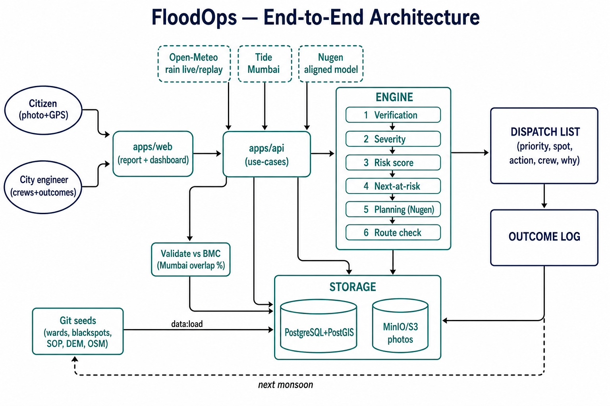

# FloodOps — Full Architecture (Start → End)

**One diagram. Whole system.**



Working name: **FloodOps** — rain + terrain + history + citizen photos → verified, scored, planned dispatch list for the city engineer.

Detail docs (not extra diagrams): `01` problem · `03` phases · `04` data · `05` repo · `06` storage tables · `07` domain/API.

---

## How to read it (left → right)

| Stage | What |
|---|---|
| **Actors** | Citizen = sensor. Officer = decision maker. |
| **Web → API** | Report page + dashboard → use-cases only. |
| **Externals** | Open-Meteo / tide (live or replay) · **Nugen (planning) — Phase 2 after shortlist**. Phase 1 decks describe planned use only. |
| **Engine 1→6** | Verify → severity → risk → next-at-risk → **planner (Nugen or SOP rules)** → route. All six ship. Steps 1–4 never need Nugen. Step 5 always returns full actions. |
| **Git seeds** | Loaded once into PostGIS (`data:load`). |
| **Storage** | PostGIS = all rows. MinIO/S3 = photo bytes only. |
| **Output** | Dispatch list + why → outcomes → next season. |
| **Side path** | Mumbai top-N vs BMC list → overlap %. |

---

## One line

```
Citizen + Officer + Rain/Tide + Git seeds
  → web → api → Engine(1–4) ↔ Planner(Nugen | SopRules) → route (6)
  → PostGIS + MinIO
  → Dispatch list → Outcome log
```

**Planner policy (nothing dropped):** Nugen aligned model is the primary planner after shortlist credits/invite. Until the key exists — and if the API fails mid-demo — **SopRulePlanner** fills the same schema (`action`, `crew`, `priority`, `explanation`) from SOP rules + risk breakdown. We never ship a product that only ranks spots without actions. Route check and outcome log stay in scope (built after the dashboard, not abandoned).

---

## Explainability on each row

```json
{
  "priority": 1,
  "spot": "…",
  "action": "pump",
  "crew": "Pump unit 3",
  "why": {
    "rain_next_3h_mm": 42,
    "terrain_low_point": 0.91,
    "blackspot_since": 2019,
    "verified_reports": 3,
    "severity": "impassable",
    "route_ok": true
  },
  "explanation": "…"
}
```

---

## Words we do not use

| Don't say | Say |
|---|---|
| prediction | next-at-risk |
| fake detection | credibility score |
| all-India | Mumbai validate · Pune demo |
| government uses this | pilot-ready |
| flood forecast | response prioritisation |

---

## Build order = fill these boxes

| Phase | Boxes |
|---|---|
| 0–1 / MVP-10 | Diagram + deck + **live vertical slice** by 10 Sep |
| Right after 10 Sep | Nugen signup when invite; thicken data; Mumbai validate |
| Then | Route + outcome · video · harden |

If it is not in the image, it is out of scope.
