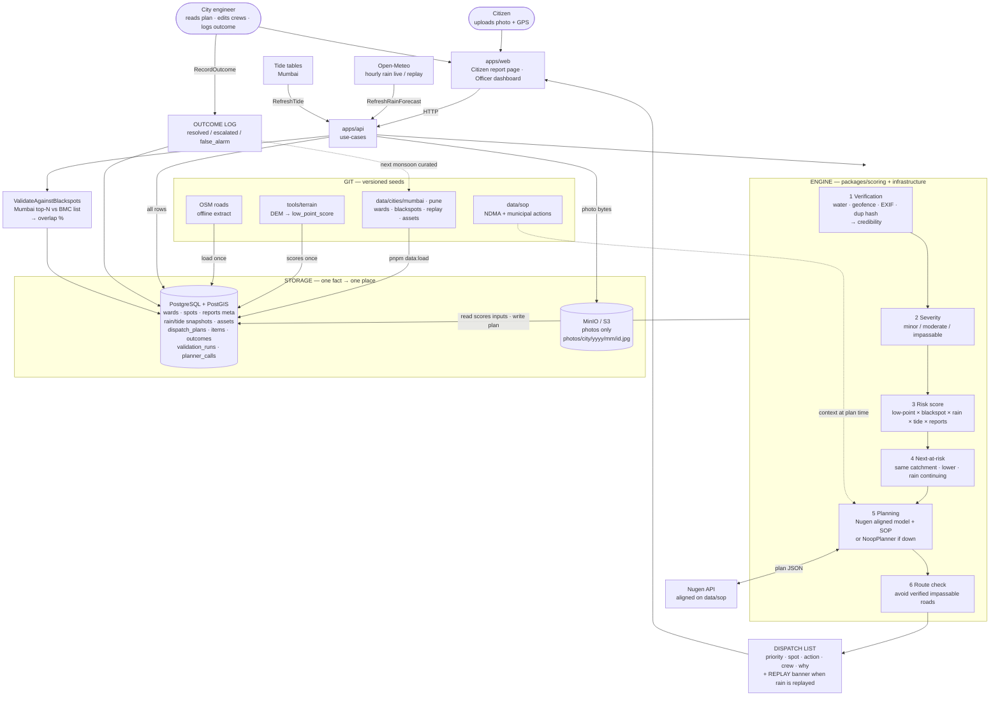

# FloodOps — Full Architecture (Start → End)

**This is the single document.** One diagram below is the whole system. Everything else is labels for that diagram.

Working name: **FloodOps**. Product in one line: rain + terrain + history + citizen photos → verified, scored, planned dispatch list for the city engineer.

Related docs (detail only): `01` problem · `03` phases · `04` data sources · `05` repo tree · `06` storage tables · `07` domain/API.

---

## The architecture (all in one)



---

## How to read it (left → right / top → bottom)

| Stage | What |
|---|---|
| **Actors** | Citizen = sensor. Officer = decision maker. |
| **Web** | Two screens only: report form + dashboard. |
| **API** | Use-cases wire everything; no business logic in routes. |
| **Engine 1→6** | Verify → severity → risk → anticipate → Nugen plan → route. Scoring is code; Nugen is planning only. |
| **Externals** | Open-Meteo + tide = live/replay weather. Nugen = structured actions + explanations. |
| **Git seeds** | Loaded once into PostGIS. SOP text fed to Nugen at plan time. |
| **Stores** | PostGIS = all structured state. Object storage = photo files only. |
| **Output** | Ranked dispatch list with a `why` panel. Outcomes write back. Mumbai validation is a side path for the accuracy number. |

---

## Same path as a single line

```
Citizen photo + Officer crews
        + Open-Meteo/Tide (+ optional REPLAY)
        + Git seeds (wards, blackspots, terrain, roads, SOP)
                ↓
apps/web → apps/api → Engine(1–6) → Nugen
                ↓
        PostGIS + MinIO
                ↓
   Dispatch list → Officer → Outcome log → (next season) seeds
```

---

## Explainability (what sits on each dispatch row)

```json
{
  "priority": 1,
  "spot": "…",
  "action": "pump",
  "crew": "Pump unit 3",
  "why": {
    "rain_next_3h_mm": 42,
    "terrain_low_point": 0.91,
    "blackspot_since": 2019,
    "verified_reports": 3,
    "severity": "impassable",
    "route_ok": true
  },
  "explanation": "…"
}
```

---

## Words we do not use

| Don't say | Say |
|---|---|
| prediction | next-at-risk / anticipation |
| fake detection | credibility score |
| all-India | Mumbai validate · Pune demo · engine city-agnostic |
| government uses this | pilot-ready |
| flood forecast | response prioritisation |

---

## Build order (when boxes get filled)

| Phase | Boxes you actually build |
|---|---|
| 0–1 | This doc + deck + Nugen slide |
| 2.0–2.2 | Git load → PostGIS · rain live/replay |
| 2.3–2.4 | Engine steps 1–3 · citizen → MinIO |
| 2.5–2.6 | Engine 5–6 · Nugen · dashboard |
| 2.7 | Validation side path |
| 2.8–2.9 | Route + outcome (cuttable) |
| 3 | Harden the same diagram — no new boxes |

If a feature does not appear in the diagram above, it is out of scope.
