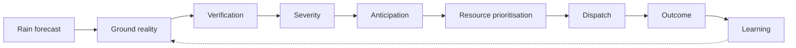

# Problem Statement

## Full statement

During heavy rain, municipal and local disaster teams receive generic weather alerts and a flood of citizen complaints, but no system to turn them into action. In most Indian cities — especially outside the metros — flood response still runs on phone calls, guesswork, and whoever complains loudest. The same blackspots flood every monsoon, crews arrive after roads are already impassable, and scarce pumps and equipment are sent to the wrong places while critical locations wait. Citizens who can see the water have no trusted channel to report it with evidence, and officers have no way to separate a real, urgent incident from noise.

The problem is not a lack of weather data; it is the absence of a system that converts fragmented rainfall, terrain, historical, and citizen data into an explainable, prioritised response plan that tells the city engineer exactly where to go, what to do, and in what order before waterlogging peaks.

## Specifically, cities lack

| # | Gap | What is missing |
|---|---|---|
| 1 | **Verification** | Citizen complaints are duplicated, outdated, or false, with no evidence-based check. |
| 2 | **Severity assessment** | No way to distinguish minor waterlogging from a critical, impassable location. |
| 3 | **Anticipation** | Response begins after flooding instead of flagging which nearby low points are next at risk. |
| 4 | **Resource prioritisation** | Limited pumps and crews are not allocated intelligently across simultaneous incidents. |
| 5 | **Access awareness** | Teams are dispatched without knowing whether reported flooded roads block their route. |
| 6 | **Institutional learning** | Incident and response data is never retained, so every monsoon starts from zero. |

## Problem flow

## Short abstract (registration form)

Indian cities receive rain forecasts and citizen complaints but lack a system to verify reports, judge severity, anticipate which locations fail next, and prioritise limited pumps and crews across simultaneous incidents. Response remains reactive and repetitive, with the same blackspots flooding every monsoon. We address the gap between fragmented weather, terrain, historical, and citizen data and the explainable, prioritised dispatch plan a city engineer actually needs.

## Who the user is

- **Primary:** city engineer / municipal disaster cell in a ULB without a command centre.
- **Secondary:** citizens — as a *sensor*, not the audience. They submit evidence; they do not manage the response.

## What this is not

- Not a weather app. IMD and Open-Meteo already forecast rain.
- Not a hydrological flood model. Rankings are scored heuristics anchored to documented history.
- Not a citizen complaint CRM. Complaints are one input to a dispatch decision.
- Not a claim of government adoption. It is pilot-ready; no ULB has deployed it.
