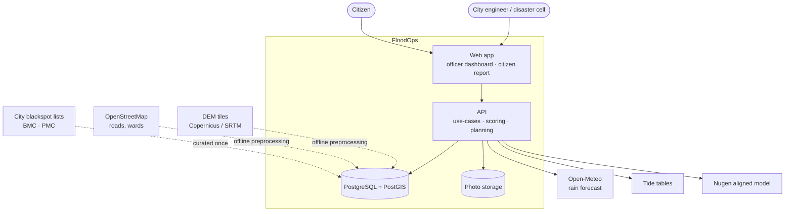
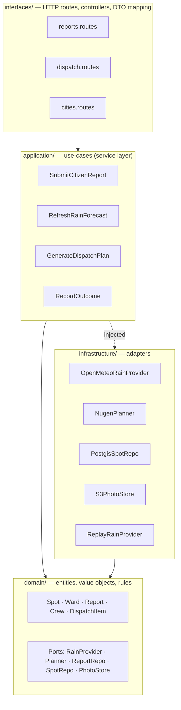
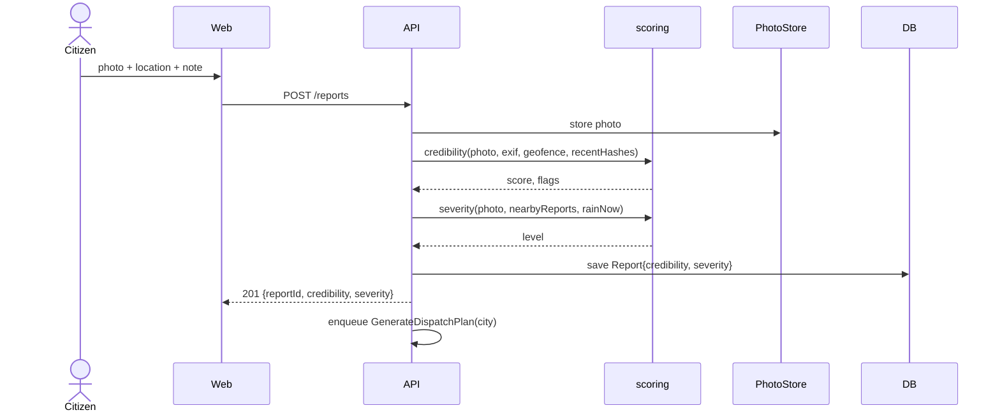
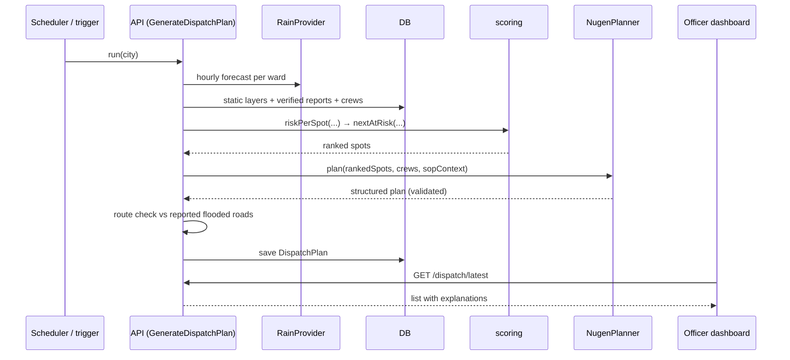

# Architecture (detail views)

**Prefer the single end-to-end doc:** [`00-full-architecture.md`](00-full-architecture.md).

This file keeps four zoomed-in views: context, data pipeline, code layers, and runtime sequences.

---

## 1. System context

Who and what touches the system.



---

## 2. Data pipeline

How one dispatch list is produced. Left to right, every hour or on every new report.

```mermaid
flowchart LR
    subgraph Static["Static layer (per city, loaded once)"]
        WARDS[Ward polygons]
        LOW[Terrain low-point score]
        BLACK[Blackspot history]
        ROADS[Road graph]
    end

    subgraph Live["Live layer"]
        RAIN[Hourly rain per ward]
        TIDEL[Tide level]
        REPORTS[Citizen reports]
        CREWS[Crew / pump availability]
    end

    subgraph Scoring["packages/scoring — pure functions"]
        CRED[Credibility score<br/>water detected · geofence · EXIF age · duplicate hash]
        SEV[Severity estimate<br/>depth cues · report count · rain intensity]
        RISK[Spot risk = f(low, black, rain, tide, verified reports)]
        NEXT[Next-at-risk<br/>same catchment · lower elevation · rain continuing]
    end

    subgraph Planning["apps/api — use-cases"]
        NUGENP[Nugen aligned model<br/>SOP → action · crew · priority · explanation]
        ROUTE[Route check<br/>road graph minus reported flooded segments]
    end

    OUT[Dispatch list<br/>JSON + UI]
    LOGDB[(Incident & outcome log)]

    REPORTS --> CRED --> SEV --> RISK
    RAIN --> RISK
    TIDEL --> RISK
    LOW --> RISK
    BLACK --> RISK
    RISK --> NEXT --> NUGENP
    CREWS --> NUGENP
    NUGENP --> ROUTE
    ROADS --> ROUTE
    ROUTE --> OUT --> LOGDB
```

### Where Nugen sits, precisely

Nugen does **not** compute risk. Scoring is deterministic code so every number is explainable.

Nugen's aligned model receives the scored, ranked spots plus crew availability and the city's flood SOP corpus, and returns a **structured plan**: for each spot — action (`pump` / `desilt` / `barricade` / `monitor`), crew assignment, priority, and a one-paragraph justification an officer can read. Alignment on SOPs is what makes it output municipal actions instead of generic advice.

Output is validated against a schema before it reaches the UI. If the model returns something unparseable, the officer sees the ranked list without actions rather than a broken screen.

---

## 3. Code layers (clean architecture)

Dependencies point inward only. Nothing in `domain` imports from anywhere else.



`packages/scoring` is pure TypeScript with no I/O — `domain` calls it, tests cover it exhaustively, and it is the same code for every city.

`ReplayRainProvider` implements the same port as `OpenMeteoRainProvider`. Switching to replay mode is a config flag, not a code path.

---

## 4. Runtime sequences

### 4a. Citizen submits a report



### 4b. Dispatch plan is generated



---

## 5. Explainability contract

Every dispatch item carries its own evidence. This is the thing judges and officers will click on.

```json
{
  "spot": "Sinhagad Rd – Vitthalwadi underpass",
  "priority": 1,
  "action": "pump",
  "crew": "Pump unit 3 (Warje depot)",
  "why": {
    "rain_next_3h_mm": 42,
    "terrain_low_point": 0.91,
    "blackspot_since": 2019,
    "verified_reports": 3,
    "severity": "impassable",
    "route_ok": true
  },
  "explanation": "Three verified reports show vehicle-depth water; 42 mm forecast in next 3h; chronic blackspot; route via Karve Rd is clear."
}
```
