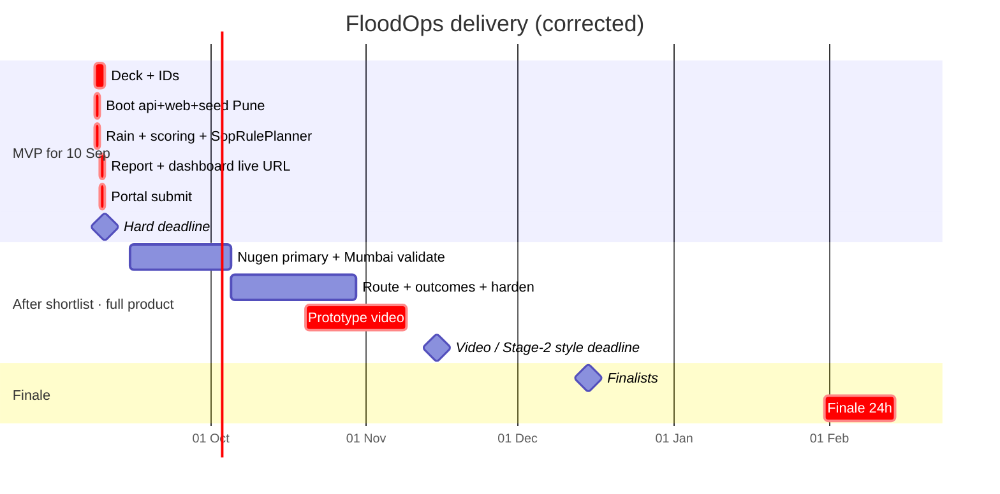

# Phases

Mapped to Indradhanu – PCCOE IGC 2026. **Team hard gate: working prototype live by 10 Sep 2026** (same day as portal registration). Confirm portal fields each time you open the form.

Each sub-phase has: **Goal · Tasks · Owner · Deliverable · Done when · Risk.** "Done when" is binary. If it can't be checked, it isn't done.

**Build rule:** one slice, one test, then the next slice. Create a folder the week you fill it. If a slice is not demoable (curl, test, or screen), it does not exist.

Roles: **Geo** (data/terrain), **Vision** (intake/photos), **AI** (Nugen/scoring), **Front** (dashboard/deck/video). Team lead is whoever owns the deadline that week.

### Portal vs team target (as of 8 Sep 2026)

Checked on [pccoeigc.com/registration](https://www.pccoeigc.com/registration) Step 3.  
**Team rule overrides form labels:** Live Link + Code Repository are **compulsory for us**. We do not submit without both working.

| Upload / field | Form label | Our rule for 10 Sep |
|---|---|---|
| PPT PDF ≤ 5 MB | Required | **Compulsory** |
| Combined ID cards PDF ≤ 5 MB | Required | **Compulsory** |
| Project abstract, domain, topic | Required | **Compulsory** |
| Live Link URL | Marked optional on site | **COMPULSORY** — working prototype URL must open |
| Code Repository URL | Marked optional on site | **COMPULSORY** — repo must contain runnable code |
| NOC | Not needed this round | Skip |
| Nugen API | Not on form | Planned on PPT; SopRulePlanner runs on the live demo |

**Hard gate 10 Sep:** no Live Link that demos the dispatch loop + no repo = **not ready to submit**.

### Vertical slices (test after each)

| Slice | Working thing | Due |
|---|---|---|
| 0 | Docs | Done |
| **MVP-10** | PPT + IDs + **live demo** + repo | **10 Sep hard** |
| 2.x full | Route, outcomes, Mumbai number, Nugen primary, video | After shortlist → Nov |

**Scope rule:** full product still ships. By 10 Sep we ship a **vertical MVP** (rain → score → plan → screen). Route, outcomes, Mumbai validation, polish continue immediately after — not dropped.

---

## Timeline

---

## Phase 0 — Foundation ✅

**Goal:** anyone opening the repo understands the problem and the system in five minutes.

| Deliverable | Status |
|---|---|
| Problem statement (`docs/01`) | Done |
| Architecture, four views (`docs/02`) | Done |
| Data honesty table (`docs/04`) | Done |
| Repo conventions and layer rules (`docs/05`) | Done |

---

## Phase MVP-10 — Working prototype + registration (NOW → 10 Sep)

**Hard gate: 10 Sep 2026.** Deliverables: PPT + IDs + **working live demo** + repo URL + portal submit.

This is a **thin vertical slice of the full architecture**, not a different product. Every engine box exists; some adapters are simpler (JSON seed, SopRulePlanner, local photos). Full Nugen / route / outcomes / Mumbai overlap continue right after submit — still in scope.

### Hour-by-hour (8–10 Sep)

| When | Build | Done when |
|---|---|---|
| **Day 1 morning** | Name + one-liner; deck draft in parallel | Name locked; slide outline exists |
| **Day 1** | `pnpm` api + web; SQLite or PostGIS; seed **Pune** spots + blackspots CSV | `GET /health`, `GET /cities/pune/spots` |
| **Day 1 night** | Open-Meteo or replay JSON; `packages/scoring` risk + credibility stubs; **SopRulePlanner** full actions | `POST /dispatch/generate` returns place→action→crew→why |
| **Day 2** | `/report` photo upload (disk); `/dashboard` list + why panel; deploy (Vercel/Railway/etc.) | Live URL works on a phone |
| **Day 2 night** | PPT PDF ≤ 5 MB; ID PDF; fill portal; paste Live Link + Repo | Portal = submitted **before** 10 Sep night if possible |
| **Day 3 buffer** | Fix demo bugs only; screenshot confirmation | Hard deadline |

### MVP-10 must include (nothing faked as “done later” on the live URL)

1. Citizen can submit a report (photo + location)  
2. Officer sees ranked dispatch list with **action + crew + why** (SopRulePlanner)  
3. Rain signal live or **REPLAY**-labelled  
4. Honesty: Nugen marked **planned primary**; SOP rules running now  
5. Repo README: how to run locally  

### MVP-10 may be thinner (still on roadmap for week after)

- Mumbai validation number  
- Full DEM pipeline  
- Route check  
- Outcome log  
- Real Nugen API (swap in when invite/credits arrive)  

**Not dropped — scheduled immediately after 10 Sep.**

### Parallel: deck + paperwork (same window)

| Task | Owner | Done when |
|---|---|---|
| Deck PDF ≤ 5 MB (Nugen planned primary + SOP stand-in) | Front | File ready |
| Combined ID cards PDF ≤ 5 MB | Lead | File ready |
| Mentor details | Lead | On form |
| Portal: Disaster Resilience · Disaster Forecasting & Response · abstract · live + repo | Lead | Submitted screenshot |

**Phase MVP-10 gate:** live URL shows the dispatch loop; portal submitted; PPT matches what the live URL can do.

---

## Phase 2 — Full product after 10 Sep (nothing dropped)

**Window:** 10 Sep submit → 15 Nov 2026. Continue from the MVP — harden and fill remaining boxes. **Full product scope:** route, outcomes, Mumbai number, Nugen primary, video all ship.

**Nugen credit milestones (from the rules):** shortlisted teams receive credits by ~1 Oct on submitting a project using aligned-model inference; full use through 15 Nov unlocks more. → Signup/invite only **after shortlist**. **2.5 must produce a real plan by ~30 Sep.**

### 2.0 Project setup

| | |
|---|---|
| Goal | Repo skeleton that enforces the architecture from day one |
| Tasks | pnpm monorepo: `apps/api`, `apps/web`, `packages/scoring`, `packages/shared` · TS `strict` everywhere · ESLint import-boundary rule for the four API layers · Docker Compose: PostgreSQL + PostGIS · `.env.example` · CI: lint + typecheck + `packages/scoring` tests on every push · README "run locally" section |
| Owner | AI (structure), Front (web bootstrap) |
| Deliverable | `pnpm dev` starts api + web + db on a clean machine |
| Done when | CI green on an empty commit; a deliberate cross-layer import fails lint |
| Risk | Tooling rabbit hole → 3 days cap, no custom build magic |

### 2.0b Nugen onboarding (after shortlist only)

| | |
|---|---|
| Goal | Unlock credits / prize track and write truthful integration notes |
| Tasks | Sign up with institute email · enter invite code organisers give (e.g. `IN2027PCCOE` if still valid) · obtain API key into team vault (not git) · one successful inference call · read alignment cookbook · write `docs/nugen-notes.md` (5–10 lines: aligned model = SOP planning, not risk) · attend alignment workshop when scheduled |
| Owner | AI |
| Deliverable | API key in vault; `docs/nugen-notes.md` |
| Done when | One successful inference from a team laptop |
| Risk | Waiting on organiser invite → keep building 2.0–2.4; use **SopRulePlanner** for actions until key exists, then attach Nugen as primary |

### 2.1 Data layer

| | |
|---|---|
| Goal | City-agnostic static layer, two cities loaded |
| Tasks | PostGIS schema: `cities`, `wards`, `spots`, `blackspots`, `roads` · Mumbai wards GeoJSON · Pune wards GeoJSON · Mumbai blackspots from BMC list → `blackspots.csv` with `source_url` per row · Pune blackspots hand-curated (target 40–100) with `source_url` per row · DEM: download tiles, `tools/terrain/` computes sink/flow-accumulation → `low_point_score` per spot/ward · `sources.md` per city · loader CLI: `pnpm data:load <city>` |
| Owner | Geo |
| Deliverable | Both cities queryable; `data/cities/<city>/` matches contract in `docs/04` |
| Done when | `SELECT count(*)` returns expected rows for both cities; every blackspot row has a source; loading a third empty city folder fails with a clear message, not a crash |
| Risk | Pune blackspot list too thin → accept 40, say so; DEM processing slow → precompute once, commit the derived CSV not the tiles |

### 2.2 Rain provider + replay

| | |
|---|---|
| Goal | Live rain per ward, and a replay path that is the same code |
| Tasks | `RainProvider` port · `OpenMeteoRainProvider`: hourly precipitation + soil moisture at ward centroids, batched, cached 30 min · `ReplayRainProvider`: serves `data/cities/<city>/replay/<event>.json` · store 2 events per city (one peak day, one moderate day) · scheduler: refresh hourly · `RAIN_MODE=live|replay` flag |
| Owner | Geo |
| Deliverable | `RefreshRainForecast` use-case; `GET /cities/:id/rain` |
| Done when | Flipping the flag changes the data with zero code change; live call succeeds for both cities; contract test passes against a recorded Open-Meteo response |
| Risk | Rate limit (10k/day) → cache; provider outage → last-good snapshot served with `stale: true` |

### 2.3 Scoring engine

| | |
|---|---|
| Goal | Pure, tested, explainable numbers |
| Tasks | In `packages/scoring`, no I/O: `credibility(input)` — water-detected flag, geofence distance, EXIF age, duplicate-hash hit → 0–1 + reasons · `severity(input)` — depth cue, report count, rain intensity → `minor / moderate / impassable` · `risk(spot)` — weighted low-point, blackspot age, rain next 3 h, tide, verified reports → 0–1 + breakdown · `nextAtRisk(spots, rain)` — same catchment, lower elevation, rain continuing · every function returns `{ value, breakdown }` — the breakdown feeds the "why" panel · weights in one config file · unit tests for every branch and edge |
| Owner | AI |
| Deliverable | `packages/scoring` at 100 % branch coverage |
| Done when | Given the same inputs, output is identical and every number in the breakdown is traceable to an input |
| Risk | Over-engineering with ML → explicitly rule-based; document why (no training data exists) |

### 2.4 Citizen intake

| | |
|---|---|
| Goal | The only live ground-truth signal, with honest verification |
| Tasks | Web: `/report` page — in-app camera capture preferred (keeps EXIF), location from device, optional note · API: `POST /reports` → `SubmitCitizenReport` use-case · `PhotoStore` adapter (S3-compatible / local disk in dev) · water-in-image detection (small vision model or Nugen vision if available; record which) · EXIF read: GPS + timestamp; geofence vs reported location; age vs now · perceptual hash vs last 24 h reports within 200 m · response returns credibility + severity + reasons · reports flagged `low_credibility` stay visible to officer but weigh less |
| Owner | Vision |
| Deliverable | Report → scored in < 5 s; visible on dashboard |
| Done when | Test set: 20 flood photos, 20 non-flood, 5 duplicates → water detection ≥ 85 %, duplicates 5/5 caught, stripped-EXIF photos get lower score not rejection |
| Risk | EXIF stripped by browsers → in-app capture path; vision model accuracy → report the number honestly, never say "fake detection" |

### 2.5 Dual planner (Nugen + SOP rules — nothing dropped)

| | |
|---|---|
| Goal | Every dispatch item always gets action + crew + priority + explanation. Nugen is primary when available; SOP rules cover the gap so we never ship an empty plan. |
| Tasks | `data/sop/`: NDMA + municipal SOP excerpts, chunked · `Planner` port · **`SopRulePlanner`**: deterministic map from severity/risk/blackspot → `pump` / `desilt` / `barricade` / `monitor` + nearest available crew + template explanation using breakdown numbers · **`NugenPlanner`**: same input/output schema, aligned on SOP corpus when invite/credits exist · zod validate both · prefer Nugen when key + healthy; else SopRulePlanner · log provider used on every plan · attend Nugen workshop when offered · invite signup as soon as shortlist email arrives · optional: request demo credits at nugen.in if invite is slow |
| Owner | AI |
| Deliverable | `GenerateDispatchPlan` always returns full plan rows (never priority-only) |
| Done when | 10 replay scenarios → 10 valid full plans with **either** provider; switching `PLANNER=nugen|sop-rules` needs zero UI change; Nugen path used in at least one recorded demo before video |
| Risk | Invite late → SopRulePlanner is still a real planner (not a blank list). Nugen stays in architecture and PPT as the aligned-model path. |

### 2.6 Officer dashboard

| | |
|---|---|
| Goal | The screen the city engineer opens at 6 am on a rain day |
| Tasks | Ward map with rain overlay and spot markers coloured by risk · ranked dispatch list (right panel): priority, spot, action, crew, severity badge · "why" drawer per item: breakdown numbers + explanation + report photos · crew/pump availability form → triggers re-plan · replay toggle with persistent **REPLAY** banner · city switcher (Mumbai / Pune) · `services/` typed client, one function per endpoint · no auth for prototype; say so |
| Owner | Front |
| Deliverable | `/dashboard` end-to-end on Pune |
| Done when | Submitting a photo from a phone moves a spot up the list within 60 s; editing crews changes assignments; every item's "why" opens |
| Risk | Map library time sink → MapLibre + GeoJSON, no 3D, no clustering |

### 2.7 Mumbai validation

| | |
|---|---|
| Goal | The one accuracy number |
| Tasks | `ValidateAgainstBlackspots` use-case · replay Mumbai peak event, no citizen reports · take top-N ranked spots (N = 50, 100) · overlap with BMC published list within 150 m · document method in `docs/06-validation.md` · run on Pune too, report honestly even if weak |
| Owner | Geo + AI |
| Deliverable | `pnpm validate mumbai` prints the number; doc explains it |
| Done when | Number is reproducible from a clean clone |
| Risk | Number is low → tune weights *once*, document the change, never tune on Pune (that's your demo city, not your validation city) |

### 2.8 Route check

| | |
|---|---|
| Goal | Gap 5, honestly scoped |
| Tasks | OSM road graph per city into PostGIS · depot locations (mocked, officer-editable) · shortest path depot → spot excluding road segments within 50 m of a verified `impassable` report · `route_ok: boolean` + alternative on each dispatch item |
| Owner | Geo |
| Deliverable | Route badge on dispatch items |
| Done when | Marking a road segment flooded flips `route_ok` and reroutes |
| Risk | Routing engine complexity → pgRouting or a simple Dijkstra over OSM edges; no live traffic, say so |

### 2.9 Outcome log

| | |
|---|---|
| Goal | Gap 6 as storage, not ML |
| Tasks | `RecordOutcome` use-case: officer marks item `resolved / escalated / false_alarm` with timestamp · incidents table linked to plan, reports, rain snapshot · export CSV per city per season |
| Owner | Front + AI |
| Deliverable | Outcome buttons on dispatch items; export endpoint |
| Done when | A season's incidents export to CSV with all linked evidence |
| Risk | Calling it "learning" → call it "incident log"; next-season use is a roadmap line |

### 2.10 Video + hardening

| | |
|---|---|
| Goal | Prototype video that shows only what the repo can do |
| Tasks | Clean-machine run from README; fix every gap · seed script for demo state · script the 2–3 min video: (0:00) problem in 20 s · (0:20) citizen report from phone → credibility · (0:50) dashboard: ranked list, why panel · (1:30) crews edited → re-plan · (1:50) replay monsoon, labelled · (2:20) Mumbai overlap number · (2:40) honesty table, one line · record real screen, no motion graphics · upload; link in README |
| Owner | Front (video), all (hardening) |
| Deliverable | Video link + tagged release `v0.1-prototype` |
| Done when | A teammate who didn't build it runs the demo from README in < 15 min; video contains nothing not in `v0.1-prototype` |
| Risk | Feature creep in the last week → freeze on 5 Nov; only fixes after |

**Phase 2 gate:** video submitted ≥ 48 h before 15 Nov. Tagged release matches video frame by frame.

---

## Phase 3 — Grand Finale (24 h, on campus)

**Window:** finalists ≈ 15 Dec 2026; finale 31 Jan – 14 Feb 2027. **Rule: no new features.**

### 3.1 Demo script + rehearsal

| | |
|---|---|
| Goal | One person can run the demo blind |
| Tasks | 7-minute script with exact clicks · Q&A sheet: 20 likely attacks with one-line answers (BMC already has this · why not ML · is this prediction · what if Nugen is down · how do you know it's not fake · why only two cities) · rehearse 5 times, timed |
| Owner | Front (script), all (Q&A) |
| Deliverable | `docs/07-demo-script.md` (script only; Q&A stays private) |
| Done when | Any team member runs it in ≤ 7 min without notes |

### 3.2 Resilience hardening

| | |
|---|---|
| Goal | Works on hotel Wi-Fi with a judge's phone |
| Tasks | Offline-capable seed: cached rain snapshot, replay events local · Nugen down → Noop path tested on stage · photo upload from iOS and Android tested · local DB fallback if cloud DB unreachable · laptop + hotspot + spare laptop with identical state |
| Owner | AI + Geo |
| Deliverable | Demo passes with Wi-Fi off |
| Done when | Pull the network cable mid-demo; the ranked list still renders |

### 3.3 Finale day (24 h)

| Hour | Do |
|---|---|
| 0–2 | Set up, run full demo once, confirm Nugen key works on venue network |
| 2–10 | Whatever the organisers release as the finale brief — integrate only if it fits inside existing use-cases; otherwise present it as roadmap |
| 10–16 | Fix bugs found; no new features |
| 16–20 | Rehearse twice; sleep in shifts |
| 20–24 | Judging: one driver, one talker, two on Q&A |

**Phase 3 gate:** the judge uploads a photo, it appears, it's scored, a spot moves up, the "why" opens. That single sequence is the whole pitch.

---

## Full scope (nothing dropped)

Every feature below is **in the product**. Order is build sequence only.

| Order | Feature | If blocked |
|---|---|---|
| 1 | Data + rain + scoring + photos + dashboard + Mumbai number | — core path |
| 2 | **Planner** | Primary = Nugen. Stand-in = **SopRulePlanner** (same JSON). Never ship blank actions. |
| 3 | Route check | Build after dashboard; still required before video |
| 4 | Outcome log | Build after route; still required before video |
| 5 | Tide, next-at-risk UI, polish | Parallel when core is green |

**Resilience (not a substitute for features):** if Nugen fails *during a live demo*, fall back to SopRulePlanner for that request. That is uptime, not scope cut.

---

## Weekly rhythm (Phase 2)

- Monday 30 min: what's blocked, who unblocks it (never “drop it”).
- Every push: CI green or it doesn't merge.
- Friday: demo on `main` to each other, 5 minutes, from a clean clone.
- Anything not demoable on Friday is next week's first job — still in scope.
