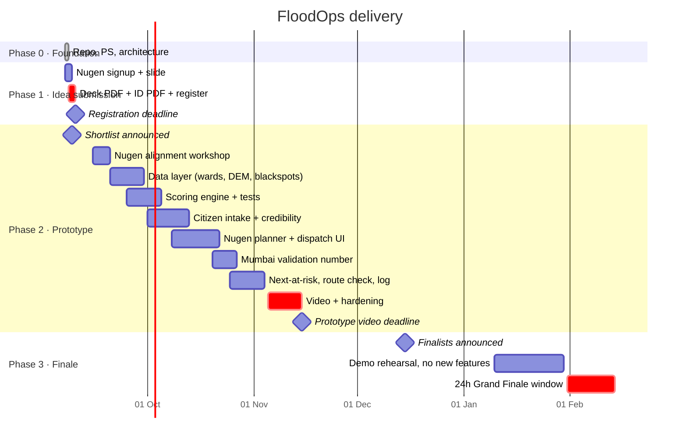

# Phases

Mapped to the three competition stages of Indradhanu – PCCOE IGC 2026. Dates from the official site; confirm against the portal before each deadline.

---

## Phase 0 — Foundation (done)

- Problem statement locked.
- Architecture and layer rules written.
- Honesty table (live / static / simulated) written.

**Gate:** anyone reading the repo understands the problem and the system in five minutes.

---

## Phase 1 — Idea submission (by 10 Sep 2026)

No code. Submission quality only.

| # | Task | Owner | Done when |
|---|---|---|---|
| 1 | Sign up on Nugen with institute email, invite `IN2027PCCOE` | AI lead | API key obtained |
| 2 | Deck as PDF, ≤ 5 MB, ~8 slides | Frontend/deck | See slide list below |
| 3 | Combined ID cards, single PDF, ≤ 5 MB | Any | Uploaded |
| 4 | Faculty mentor named | Team lead | Name + email in form |
| 5 | Register: title, domain, topic, abstract, repo link | Team lead | Confirmation received |

**Deck slides**

1. Problem (paragraph + six gaps)
2. Why now (repeat blackspots; current alerts for Mumbai / Kolkata)
3. Problem flow → solution flow diagram
4. Solution screens (mockups, labelled as mockups)
5. Data sources — the honesty table, unchanged
6. **Nugen slide** — what the aligned model does, why alignment beats a generic LLM for SOP-based action planning
7. Mumbai validation → Pune demonstration → any city
8. Team and roles

**Gate:** every claim on the deck is one the team can defend in a two-minute Q&A.

---

## Phase 2 — Prototype and video (shortlist → 15 Nov 2026)

Build strictly in this order. Items 1–4 are the prototype. Everything after is cuttable if time runs out.

| # | Build | Why this order |
|---|---|---|
| 1 | City-agnostic data layer: ward polygons, DEM low-point score, blackspot list (Mumbai full, Pune curated) | Everything ranks against this |
| 2 | Live hourly rain via Open-Meteo per ward, plus **replay mode** | Makes the system live; replay makes it demonstrable |
| 3 | Citizen report intake: photo → water detection, EXIF/geofence, duplicate hash → credibility + severity | Your only live ground-truth signal |
| 4 | Ranking + Nugen planner → dispatch list with explanations | The product |
| 5 | Mumbai validation: top-N vs BMC published spots → one overlap number | Your only real accuracy claim |
| 6 | Next-at-risk heuristic (same catchment, lower elevation, rain continuing) | Gap 3 |
| 7 | Route check on OSM avoiding reported flooded segments | Gap 5 |
| 8 | Incident and outcome log | Gap 6 — storage, nothing more |

**Nugen credit milestones (from the rules):** shortlisted teams receive credits by 1 Oct on submitting a project using aligned-model inference; full use through 15 Nov unlocks more. Item 4 must be running by early October.

**Video (2–3 min):** real screen, one Pune flow end to end (report → verify → rank → dispatch → why), replay mode clearly labelled, 20 seconds on the Mumbai overlap number.

**Gate:** prototype runs end to end on a clean machine from the README; video shows nothing that isn't in the repo.

---

## Phase 3 — Grand Finale, 24h (Jan–Feb 2027)

**Rule: no new features.** Harden the demo.

- Officer enters crew availability live; list re-plans.
- Judge uploads a photo from their phone; it appears, gets scored, and moves a spot up.
- Replay a monsoon event on demand.
- Every dispatch item opens its "why" panel.
- Fallback: if Nugen is unreachable, ranked list still renders without actions.

**Gate:** the demo works on hotel Wi-Fi with one person operating it.

---

## Team roles (four people)

| Role | Owns |
|---|---|
| Geo / data | DEM, wards, blackspots, rain provider, replay |
| Vision / intake | Photo checks, credibility, severity, citizen page |
| AI / planning | Nugen alignment, planner adapter, explanation schema, scoring engine |
| Frontend / deck | Officer dashboard, deck, video — and the person who says no to features |

---

## Cut list (pre-decided)

If behind schedule, drop in this order: 8 → 7 → 6 → Mumbai tide input → route UI polish. Never cut 1–4 or the honesty table.
