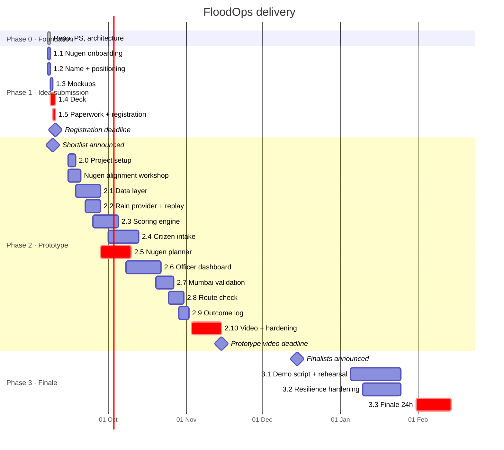

# Phases

Mapped to the three competition stages of Indradhanu – PCCOE IGC 2026. Dates from the official site; confirm against the portal before each deadline.

Each sub-phase has: **Goal · Tasks · Owner · Deliverable · Done when · Risk.** "Done when" is binary. If it can't be checked, it isn't done.

Roles: **Geo** (data/terrain), **Vision** (intake/photos), **AI** (Nugen/scoring), **Front** (dashboard/deck/video). Team lead is whoever owns the deadline that week.

---

## Timeline

---

## Phase 0 — Foundation ✅

**Goal:** anyone opening the repo understands the problem and the system in five minutes.

| Deliverable | Status |
|---|---|
| Problem statement (`docs/01`) | Done |
| Architecture, four views (`docs/02`) | Done |
| Data honesty table (`docs/04`) | Done |
| Repo conventions and layer rules (`docs/05`) | Done |

---

## Phase 1 — Idea submission

**Window:** 7 → 10 Sep 2026. **No code.** Submission quality only.

### 1.1 Nugen onboarding

| | |
|---|---|
| Goal | Be prize-eligible and able to write a truthful Nugen slide |
| Tasks | Sign up with institute email, invite `IN2027PCCOE` · obtain API key · read cookbook: one inference call, one alignment example · write 5 lines: what "aligned model" means for SOP-based action planning |
| Owner | AI |
| Deliverable | API key in team vault; `docs/nugen-notes.md` (5–10 lines, no marketing) |
| Done when | One successful inference call from a script on a team laptop |
| Risk | Waitlist delay → sign up today, not tomorrow |

### 1.2 Name + positioning

| | |
|---|---|
| Goal | Replace working name; one sentence everyone repeats identically |
| Tasks | Pick a name (short, pronounceable, not "360", not "AI") · finalise tagline · find-and-replace `FloodOps` in repo |
| Owner | Team lead |
| Deliverable | Name in README, deck, registration form — identical spelling |
| Done when | Four people say the one-liner the same way |
| Risk | Bikeshedding → 30-minute cap, then lead decides |

### 1.3 Mockups

| | |
|---|---|
| Goal | Show the officer's screen so judges see a product, not a concept |
| Tasks | Three static screens: (a) ranked dispatch list with one "why" panel open, (b) citizen report page with credibility result, (c) replay toggle + rain overlay on ward map · label every screen **MOCKUP** |
| Owner | Front |
| Deliverable | 3 PNGs in `docs/mockups/` |
| Done when | A stranger can say what the officer does on each screen without narration |
| Risk | Over-polishing → grayscale wireframes are enough |

### 1.4 Deck

| | |
|---|---|
| Goal | Get shortlisted |
| Tasks | 8 slides, PDF, ≤ 5 MB: 1 Problem (paragraph + six gaps) · 2 Why now · 3 Problem flow → solution flow · 4 Mockups · 5 Data — honesty table unchanged · 6 **Nugen** — what the aligned model does, why alignment beats a generic LLM here, where it sits (planning, not scoring) · 7 Mumbai validation → Pune demo → any city · 8 Team + roles · every claim reviewed against the "words we do not use" table |
| Owner | Front (build), all (review) |
| Deliverable | `Deck-v1.pdf` linked from README (not committed) |
| Done when | Each slide survives: "can we defend this in Q&A with what we actually have?" |
| Risk | Slide 6 sounds like an ad → describe input, output, and failure fallback, nothing else |

### 1.5 Paperwork + registration

| | |
|---|---|
| Goal | Zero rejections on formalities |
| Tasks | Combined ID cards → single PDF ≤ 5 MB · faculty mentor name + email + phone · fill form: team, members, institute, domain **Disaster Resilience**, topic **Disaster Forecasting & Response**, title, tagline, short abstract from `docs/01`, repo URL · screenshot confirmation |
| Owner | Team lead |
| Deliverable | Confirmation screenshot in team chat |
| Done when | Portal shows submitted status |
| Risk | 5 MB limit → compress PDFs before the last hour |

**Phase 1 gate:** submitted 24 h before deadline. Not on the deadline.

---

## Phase 2 — Prototype and video

**Window:** shortlist (≈ 9 Sep) → 15 Nov 2026. Build strictly in order. 2.0–2.6 are the prototype. 2.7 is the accuracy claim. 2.8–2.9 are cuttable.

**Nugen credit milestones (from the rules):** shortlisted teams receive credits by 1 Oct on submitting a project using aligned-model inference; full use through 15 Nov unlocks more. → **2.5 must produce a real plan by ~30 Sep.**

### 2.0 Project setup

| | |
|---|---|
| Goal | Repo skeleton that enforces the architecture from day one |
| Tasks | pnpm monorepo: `apps/api`, `apps/web`, `packages/scoring`, `packages/shared` · TS `strict` everywhere · ESLint import-boundary rule for the four API layers · Docker Compose: PostgreSQL + PostGIS · `.env.example` · CI: lint + typecheck + `packages/scoring` tests on every push · README "run locally" section |
| Owner | AI (structure), Front (web bootstrap) |
| Deliverable | `pnpm dev` starts api + web + db on a clean machine |
| Done when | CI green on an empty commit; a deliberate cross-layer import fails lint |
| Risk | Tooling rabbit hole → 3 days cap, no custom build magic |

### 2.1 Data layer

| | |
|---|---|
| Goal | City-agnostic static layer, two cities loaded |
| Tasks | PostGIS schema: `cities`, `wards`, `spots`, `blackspots`, `roads` · Mumbai wards GeoJSON · Pune wards GeoJSON · Mumbai blackspots from BMC list → `blackspots.csv` with `source_url` per row · Pune blackspots hand-curated (target 40–100) with `source_url` per row · DEM: download tiles, `tools/terrain/` computes sink/flow-accumulation → `low_point_score` per spot/ward · `sources.md` per city · loader CLI: `pnpm data:load <city>` |
| Owner | Geo |
| Deliverable | Both cities queryable; `data/cities/<city>/` matches contract in `docs/04` |
| Done when | `SELECT count(*)` returns expected rows for both cities; every blackspot row has a source; loading a third empty city folder fails with a clear message, not a crash |
| Risk | Pune blackspot list too thin → accept 40, say so; DEM processing slow → precompute once, commit the derived CSV not the tiles |

### 2.2 Rain provider + replay

| | |
|---|---|
| Goal | Live rain per ward, and a replay path that is the same code |
| Tasks | `RainProvider` port · `OpenMeteoRainProvider`: hourly precipitation + soil moisture at ward centroids, batched, cached 30 min · `ReplayRainProvider`: serves `data/cities/<city>/replay/<event>.json` · store 2 events per city (one peak day, one moderate day) · scheduler: refresh hourly · `RAIN_MODE=live|replay` flag |
| Owner | Geo |
| Deliverable | `RefreshRainForecast` use-case; `GET /cities/:id/rain` |
| Done when | Flipping the flag changes the data with zero code change; live call succeeds for both cities; contract test passes against a recorded Open-Meteo response |
| Risk | Rate limit (10k/day) → cache; provider outage → last-good snapshot served with `stale: true` |

### 2.3 Scoring engine

| | |
|---|---|
| Goal | Pure, tested, explainable numbers |
| Tasks | In `packages/scoring`, no I/O: `credibility(input)` — water-detected flag, geofence distance, EXIF age, duplicate-hash hit → 0–1 + reasons · `severity(input)` — depth cue, report count, rain intensity → `minor / moderate / impassable` · `risk(spot)` — weighted low-point, blackspot age, rain next 3 h, tide, verified reports → 0–1 + breakdown · `nextAtRisk(spots, rain)` — same catchment, lower elevation, rain continuing · every function returns `{ value, breakdown }` — the breakdown feeds the "why" panel · weights in one config file · unit tests for every branch and edge |
| Owner | AI |
| Deliverable | `packages/scoring` at 100 % branch coverage |
| Done when | Given the same inputs, output is identical and every number in the breakdown is traceable to an input |
| Risk | Over-engineering with ML → explicitly rule-based; document why (no training data exists) |

### 2.4 Citizen intake

| | |
|---|---|
| Goal | The only live ground-truth signal, with honest verification |
| Tasks | Web: `/report` page — in-app camera capture preferred (keeps EXIF), location from device, optional note · API: `POST /reports` → `SubmitCitizenReport` use-case · `PhotoStore` adapter (S3-compatible / local disk in dev) · water-in-image detection (small vision model or Nugen vision if available; record which) · EXIF read: GPS + timestamp; geofence vs reported location; age vs now · perceptual hash vs last 24 h reports within 200 m · response returns credibility + severity + reasons · reports flagged `low_credibility` stay visible to officer but weigh less |
| Owner | Vision |
| Deliverable | Report → scored in < 5 s; visible on dashboard |
| Done when | Test set: 20 flood photos, 20 non-flood, 5 duplicates → water detection ≥ 85 %, duplicates 5/5 caught, stripped-EXIF photos get lower score not rejection |
| Risk | EXIF stripped by browsers → in-app capture path; vision model accuracy → report the number honestly, never say "fake detection" |

### 2.5 Nugen planner

| | |
|---|---|
| Goal | Aligned model turns ranked spots + crews + SOPs into a structured, validated plan |
| Tasks | `data/sop/`: NDMA urban flooding guidelines + municipal SOP excerpts, chunked · attend Nugen alignment workshop; align on SOP corpus · `Planner` port · `NugenPlanner` adapter: input = ranked spots with breakdowns, crews, city context; output = `DispatchPlan` · zod schema for output; reject and retry once on invalid · `NoopPlanner`: returns ranked list without actions · prompt/alignment artefacts versioned in repo · log every call (input hash, latency, valid/invalid) |
| Owner | AI |
| Deliverable | `GenerateDispatchPlan` use-case producing plan with `action`, `crew`, `priority`, `explanation` per spot |
| Done when | 10 replayed scenarios → 10 valid plans; actions are from the SOP vocabulary only; explanations reference the breakdown numbers; Nugen down → Noop path renders |
| Risk | Model hallucinating actions → schema enum + SOP-only vocabulary; latency → plan generation is async, UI shows last plan + "updating" |

### 2.6 Officer dashboard

| | |
|---|---|
| Goal | The screen the city engineer opens at 6 am on a rain day |
| Tasks | Ward map with rain overlay and spot markers coloured by risk · ranked dispatch list (right panel): priority, spot, action, crew, severity badge · "why" drawer per item: breakdown numbers + explanation + report photos · crew/pump availability form → triggers re-plan · replay toggle with persistent **REPLAY** banner · city switcher (Mumbai / Pune) · `services/` typed client, one function per endpoint · no auth for prototype; say so |
| Owner | Front |
| Deliverable | `/dashboard` end-to-end on Pune |
| Done when | Submitting a photo from a phone moves a spot up the list within 60 s; editing crews changes assignments; every item's "why" opens |
| Risk | Map library time sink → MapLibre + GeoJSON, no 3D, no clustering |

### 2.7 Mumbai validation

| | |
|---|---|
| Goal | The one accuracy number |
| Tasks | `ValidateAgainstBlackspots` use-case · replay Mumbai peak event, no citizen reports · take top-N ranked spots (N = 50, 100) · overlap with BMC published list within 150 m · document method in `docs/06-validation.md` · run on Pune too, report honestly even if weak |
| Owner | Geo + AI |
| Deliverable | `pnpm validate mumbai` prints the number; doc explains it |
| Done when | Number is reproducible from a clean clone |
| Risk | Number is low → tune weights *once*, document the change, never tune on Pune (that's your demo city, not your validation city) |

### 2.8 Route check

| | |
|---|---|
| Goal | Gap 5, honestly scoped |
| Tasks | OSM road graph per city into PostGIS · depot locations (mocked, officer-editable) · shortest path depot → spot excluding road segments within 50 m of a verified `impassable` report · `route_ok: boolean` + alternative on each dispatch item |
| Owner | Geo |
| Deliverable | Route badge on dispatch items |
| Done when | Marking a road segment flooded flips `route_ok` and reroutes |
| Risk | Routing engine complexity → pgRouting or a simple Dijkstra over OSM edges; no live traffic, say so |

### 2.9 Outcome log

| | |
|---|---|
| Goal | Gap 6 as storage, not ML |
| Tasks | `RecordOutcome` use-case: officer marks item `resolved / escalated / false_alarm` with timestamp · incidents table linked to plan, reports, rain snapshot · export CSV per city per season |
| Owner | Front + AI |
| Deliverable | Outcome buttons on dispatch items; export endpoint |
| Done when | A season's incidents export to CSV with all linked evidence |
| Risk | Calling it "learning" → call it "incident log"; next-season use is a roadmap line |

### 2.10 Video + hardening

| | |
|---|---|
| Goal | Prototype video that shows only what the repo can do |
| Tasks | Clean-machine run from README; fix every gap · seed script for demo state · script the 2–3 min video: (0:00) problem in 20 s · (0:20) citizen report from phone → credibility · (0:50) dashboard: ranked list, why panel · (1:30) crews edited → re-plan · (1:50) replay monsoon, labelled · (2:20) Mumbai overlap number · (2:40) honesty table, one line · record real screen, no motion graphics · upload; link in README |
| Owner | Front (video), all (hardening) |
| Deliverable | Video link + tagged release `v0.1-prototype` |
| Done when | A teammate who didn't build it runs the demo from README in < 15 min; video contains nothing not in `v0.1-prototype` |
| Risk | Feature creep in the last week → freeze on 5 Nov; only fixes after |

**Phase 2 gate:** video submitted ≥ 48 h before 15 Nov. Tagged release matches video frame by frame.

---

## Phase 3 — Grand Finale (24 h, on campus)

**Window:** finalists ≈ 15 Dec 2026; finale 31 Jan – 14 Feb 2027. **Rule: no new features.**

### 3.1 Demo script + rehearsal

| | |
|---|---|
| Goal | One person can run the demo blind |
| Tasks | 7-minute script with exact clicks · Q&A sheet: 20 likely attacks with one-line answers (BMC already has this · why not ML · is this prediction · what if Nugen is down · how do you know it's not fake · why only two cities) · rehearse 5 times, timed |
| Owner | Front (script), all (Q&A) |
| Deliverable | `docs/07-demo-script.md` (script only; Q&A stays private) |
| Done when | Any team member runs it in ≤ 7 min without notes |

### 3.2 Resilience hardening

| | |
|---|---|
| Goal | Works on hotel Wi-Fi with a judge's phone |
| Tasks | Offline-capable seed: cached rain snapshot, replay events local · Nugen down → Noop path tested on stage · photo upload from iOS and Android tested · local DB fallback if cloud DB unreachable · laptop + hotspot + spare laptop with identical state |
| Owner | AI + Geo |
| Deliverable | Demo passes with Wi-Fi off |
| Done when | Pull the network cable mid-demo; the ranked list still renders |

### 3.3 Finale day (24 h)

| Hour | Do |
|---|---|
| 0–2 | Set up, run full demo once, confirm Nugen key works on venue network |
| 2–10 | Whatever the organisers release as the finale brief — integrate only if it fits inside existing use-cases; otherwise present it as roadmap |
| 10–16 | Fix bugs found; no new features |
| 16–20 | Rehearse twice; sleep in shifts |
| 20–24 | Judging: one driver, one talker, two on Q&A |

**Phase 3 gate:** the judge uploads a photo, it appears, it's scored, a spot moves up, the "why" opens. That single sequence is the whole pitch.

---

## Cut list (pre-decided, in order)

1. 2.9 Outcome log → roadmap slide
2. 2.8 Route check → `route_ok` shown as "not assessed"
3. Next-at-risk (part of 2.3) → remove from UI, keep in code
4. Mumbai tide input → rain-only for Mumbai
5. Dashboard polish

**Never cut:** 2.1–2.6, 2.7's number, the honesty table, replay labelling.

---

## Weekly rhythm (Phase 2)

- Monday 30 min: what's blocked, what's cut.
- Every push: CI green or it doesn't merge.
- Friday: demo on `main` to each other, 5 minutes, from a clean clone.
- Anything not demoable on Friday doesn't exist.
