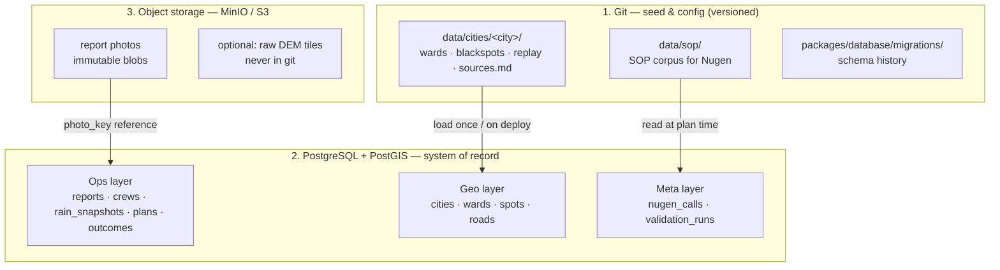
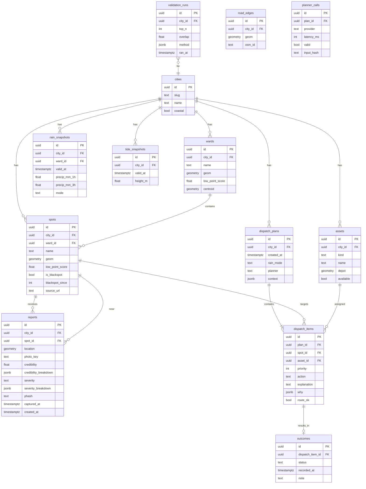

# Storage Architecture

How every piece of data is stored, where it lives, and who owns it.  
**One fact → one place.** If two stores hold the same thing, the design is wrong.

This is intentionally thinner than a generic data platform (e.g. PortSense Layer-1). FloodOps is a flood-response system, not an ingestion/schema-mapping product. We store only what the dispatch engine needs.

---

## Three stores. That's all.



| Store | Holds | Does **not** hold |
|---|---|---|
| **Git** | Curated city seeds, SOP text, migrations, small replay JSON | Photos, DEM tiles, live rain, secrets |
| **Postgres + PostGIS** | Everything queryable: geometry, reports, scores, plans, outcomes | Photo bytes, third-party API responses as “source of truth” |
| **Object storage** | Photo files (and optional raw DEM) | Structured rows, rankings, explanations |

External (not our storage): Open-Meteo, tide tables, Nugen. We **cache/snapshot** what we need into Postgres; we do not mirror their worlds.

---

## Ownership map (no overlap)

| Data | Canonical home | References |
|---|---|---|
| Ward polygons | Postgres `wards` (loaded from git GeoJSON) | Spot.ward_id |
| Blackspot history | Postgres `spots` + `blackspot_meta` (loaded from git CSV) | Risk scoring |
| Terrain low-point score | Postgres column on `spots` / `wards` (computed by `tools/terrain`) | Risk scoring |
| Road edges | Postgres `road_edges` (from OSM extract) | Route check |
| Live / replay rain | Postgres `rain_snapshots` (provider writes rows) | Risk scoring |
| Tide | Postgres `tide_snapshots` (Mumbai) | Risk scoring |
| Citizen report metadata | Postgres `reports` | Credibility, severity, risk |
| Report photo bytes | Object storage key `photos/{city}/{yyyy}/{mm}/{reportId}.jpg` | `reports.photo_key` |
| Crew / pump units | Postgres `assets` | Planner |
| Dispatch plan | Postgres `dispatch_plans` + `dispatch_items` | Dashboard |
| Officer outcome | Postgres `outcomes` | Learning log |
| Nugen request/response log | Postgres `planner_calls` | Debug, credits proof |
| BMC validation result | Postgres `validation_runs` | Accuracy claim |
| SOP corpus | Git `data/sop/*.md` (read-only at runtime) | Nugen context |
| Scoring weights | Git `packages/scoring/weights.json` | Scoring engine |

**Rule:** if a row in Postgres and a file in git both claim to be “current blackspots,” only Postgres is runtime truth after load. Git is the *source we load from*, not a second live database.

---

## Postgres schema (logical)

Tables are grouped by concern. No “sources / schemas / mappings / provenance” platform tables — those belong to a data-ingestion product, not this one.



### Migration order (numbered, one concern each)

```
packages/database/migrations/
  001_extensions.sql          -- postgis, pgcrypto
  002_cities_wards.sql
  003_spots_blackspots.sql
  004_roads.sql
  005_reports.sql
  006_assets.sql
  007_snapshots_rain_tide.sql
  008_dispatch.sql
  009_outcomes.sql
  010_planner_calls.sql
  011_validation_runs.sql
  012_indexes.sql
```

Twelve migrations. Not fourteen layers of generic pipeline tables.

---

## Object storage layout

```
bucket: floodops
└─ photos/
   └─ {city_slug}/
      └─ {yyyy}/
         └─ {mm}/
            └─ {report_id}.jpg
```

- Photos are **immutable**. Never overwrite; new report = new key.
- Postgres holds `photo_key` only. Delete DB row without deleting blob only via an explicit cleanup job (Phase 3+).
- Checksum (sha256) stored on `reports` for integrity.

Optional (not required for prototype):

```
bucket: floodops-raw
└─ dem/
   └─ {tile_id}.tif          # downloaded by tools/terrain; .gitignored
```

---

## Git data layout (seed)

```
data/
├── cities/
│   ├── mumbai/
│   │   ├── wards.geojson
│   │   ├── blackspots.csv      # lat,lon,name,since_year,source_url
│   │   ├── assets.seed.json    # default pumps/crews for demo
│   │   ├── replay/
│   │   │   ├── peak.json
│   │   │   └── moderate.json
│   │   └── sources.md          # where every file came from
│   └── pune/
│       └── (same contract)
└── sop/
    ├── ndma-urban-flooding.md
    └── municipal-response-actions.md
```

Loader: `pnpm data:load <city>` reads this folder → upserts into Postgres.  
**Git is the editable source for static geography. Postgres is what the app reads at runtime.**

---

## What we deliberately do *not* store (PortSense lessons)

| PortSense-style concept | Why FloodOps skips it |
|---|---|
| Generic `sources` / `datasets` / `artifacts` | We have fixed inputs, not arbitrary uploads |
| Source schema inference + canonical schema mapping | No multi-format ETL product |
| Provenance graph for every transform | Explainability is the `why` JSON on dispatch items |
| Entity-resolution engine | Spots are curated IDs; reports snap to nearest spot |
| Python worker fleet for large files | Photos are small; DEM is offline in `tools/terrain` |
| Dual “layer1 apps + packages domain copy” | One domain location: `packages/domain` + api application layer |

If a folder cannot be explained in one sentence related to *flood dispatch*, it does not exist.

---

## Runtime write paths (who writes what)

| Event | Writes |
|---|---|
| `pnpm data:load mumbai` | wards, spots, assets, road_edges |
| Hourly rain job / replay | rain_snapshots |
| Tide job (Mumbai) | tide_snapshots |
| Citizen `POST /reports` | object photo + reports row |
| Officer updates crews | assets.available |
| `GenerateDispatchPlan` | dispatch_plans, dispatch_items, planner_calls |
| Officer marks outcome | outcomes |
| `pnpm validate mumbai` | validation_runs |

Reads never invent a second copy of write data.

---

## Local vs deploy

| Environment | Postgres | Object storage |
|---|---|---|
| Dev | Docker Compose PostGIS | MinIO in Compose (or local `uploads/` disk adapter) |
| Demo / finale | Same Compose on laptop, or one small managed Postgres | MinIO local or single S3 bucket |
| Secrets | `.env` only | keys never in git |

`PhotoStore` port has two adapters: `LocalDiskPhotoStore`, `S3PhotoStore`. Same key scheme either way.
