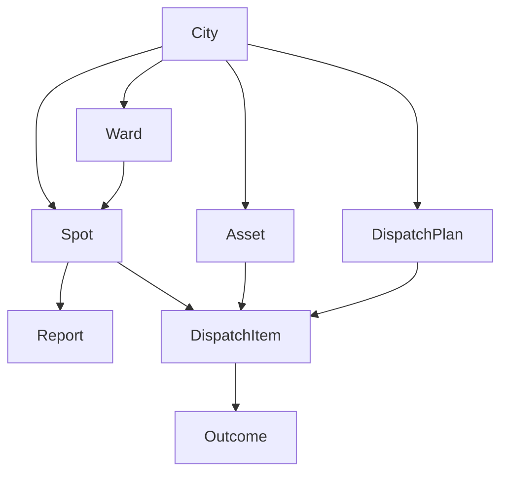

# Domain Model

Entities the product understands. Names match folders and table names.  
**No duplicate concepts** (e.g. we do not have both `Location` and `Spot` and `Blackspot` as three entities — a blackspot is a flag on a Spot).

---

## Core entities



| Entity | Meaning | Identity |
|---|---|---|
| **City** | Municipality we support (`mumbai`, `pune`) | slug |
| **Ward** | Administrative polygon | city + ward name/code |
| **Spot** | Flood-relevant location (junction, underpass, drain mouth). May be a historical blackspot | city + coordinates + name |
| **Report** | One citizen submission with photo + location | uuid |
| **Asset** | Pump unit or crew based at a depot | uuid |
| **RainSnapshot** | Hourly precip for a ward at a time | city + ward + valid_at + mode |
| **TideSnapshot** | Tide height (coastal cities) | city + valid_at |
| **DispatchPlan** | One generated plan for a city at a moment | uuid |
| **DispatchItem** | One ranked action in a plan | plan + spot + priority |
| **Outcome** | Officer result for an item | dispatch_item |
| **ValidationRun** | Overlap score vs published blackspot list | city + ran_at |

Value objects (not tables): `Credibility`, `Severity`, `RiskBreakdown`, `Why`, `GeoPoint`.

---

## Bounded contexts (folders match these)

Keep code ownership aligned so two people do not edit the same idea in two places.

| Context | Owns | Package / area |
|---|---|---|
| **Geography** | City, Ward, Spot, roads, load-from-git | `packages/database` + `tools/terrain` + `data/cities` |
| **Ingest (citizen only)** | Report, photo store, credibility inputs | `SubmitCitizenReport` use-case |
| **Scoring** | Pure risk / credibility / severity / next-at-risk | `packages/scoring` only |
| **Planning** | DispatchPlan, Nugen/Noop planner | `GenerateDispatchPlan` |
| **Operations** | Asset availability, Outcome | dashboard forms |
| **Validation** | ValidationRun | `ValidateAgainstBlackspots` |

---

## Ports (interfaces) — single definition each

Defined once in `packages/domain/ports/` (or `apps/api/src/domain/ports/` if we keep domain inside api — **pick one; see repo structure**).

| Port | Responsibility |
|---|---|
| `RainProvider` | Live or replay rain series |
| `TideProvider` | Tide series (no-op inland) |
| `PhotoStore` | put/get photo bytes by key |
| `Planner` | Spots + assets + SOP → DispatchPlan |
| `CityRepository` | cities, wards, spots, roads |
| `ReportRepository` | reports CRUD + spatial queries |
| `AssetRepository` | assets CRUD |
| `PlanRepository` | plans + items |
| `OutcomeRepository` | outcomes |
| `SnapshotRepository` | rain/tide snapshots |
| `ValidationRepository` | validation runs |

Repositories talk SQL. Providers talk HTTP/files. Scoring is **not** a port — it is a pure library.

---

## Use-cases (application services)

One file, one verb, one transaction boundary where needed.

| Use-case | Reads | Writes |
|---|---|---|
| `LoadCityData` | git `data/cities` | wards, spots, assets, roads |
| `RefreshRainForecast` | RainProvider | rain_snapshots |
| `RefreshTide` | TideProvider | tide_snapshots |
| `SubmitCitizenReport` | PhotoStore, scoring, SpotRepo | photo + reports |
| `UpdateAssetAvailability` | — | assets |
| `GenerateDispatchPlan` | snapshots, reports, spots, assets, Planner | plans, items, planner_calls |
| `RecordOutcome` | — | outcomes |
| `ValidateAgainstBlackspots` | spots, scoring, replay rain | validation_runs |
| `GetLatestDispatch` | plans | — |

---

## API surface (thin, mirrors use-cases)

```
GET    /health
GET    /cities
GET    /cities/:slug/wards
GET    /cities/:slug/spots
GET    /cities/:slug/rain
POST   /cities/:slug/rain/refresh
POST   /cities/:slug/reports
GET    /cities/:slug/reports
GET    /cities/:slug/assets
PATCH  /cities/:slug/assets/:id
POST   /cities/:slug/dispatch/generate
GET    /cities/:slug/dispatch/latest
POST   /dispatch/items/:id/outcome
POST   /cities/:slug/validate
```

No separate controllers for “schema / mapping / provenance / artifact.” Those are not product concepts here.
